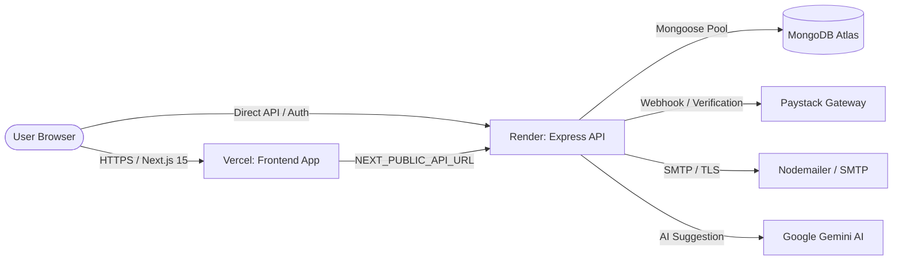

# 🚀 La-Minks Full-Stack Deployment Guide (Vercel & Render)

This document provides a step-by-step guide for deploying the **La-Minks** platform into production using **Vercel** (Frontend) and **Render** (Backend).

---

## 🏗️ Architecture Overview



| Component | Platform | Tech Stack | Root Directory |
| :--- | :--- | :--- | :--- |
| **Frontend** | **Vercel** | Next.js 15 (App Router), Tailwind CSS, Zustand, Lucide | `frontend` |
| **Backend** | **Render** | Node.js, Express, MongoDB Atlas, JWT, Mongoose | `backend` |
| **Database** | **MongoDB Atlas** | Cloud MongoDB (Replica Set / M0/M10) | Cloud |
| **Payments** | **Paystack** | Webhooks & Payment Gateway | SaaS |

---

## 📋 Pre-Deployment Checklist

Before deploying, ensure you have active credentials for:
1. **GitHub Account**: Repository access to `Malopex7/la-minks`
2. **MongoDB Atlas**: Connection string (`mongodb+srv://...`)
3. **Paystack Dashboard**: Test/Live Public & Secret keys
4. **Google Cloud / Gemini**: API key for quote enhancement
5. **Firebase Console**: Web SDK configuration for client-side Auth
6. **SMTP Provider**: Gmail App Password or SendGrid / Postmark credentials

---

## 🔷 PART 1: Deploy Backend to Render

### 1. Create a New Web Service
1. Log in to [Render Dashboard](https://dashboard.render.com/).
2. Click **New +** &rarr; **Web Service**.
3. Connect your GitHub repository: `Malopex7/la-minks`.

### 2. Configure Service Settings

| Setting | Value |
| :--- | :--- |
| **Name** | `la-minks-backend` (or your preferred name) |
| **Region** | `Frankfurt (EU Central)` or closest to South Africa |
| **Branch** | `master` |
| **Root Directory** | `backend` |
| **Runtime** | `Node` |
| **Build Command** | `npm install` |
| **Start Command** | `node src/index.js` |
| **Instance Type** | `Free` or `Starter` |

### 3. Set Backend Environment Variables

In the **Environment** tab of your Render service, add the following variables:

```env
# Server & Environment
NODE_ENV=production
PORT=10000

# Database
MONGO_URI=mongodb+srv://<username>:<password>@laminks.8wnmsnz.mongodb.net/la-minks-db?retryWrites=true&w=majority

# Security & JWT (Generate strong 64-char hex strings)
JWT_SECRET=your_super_secret_64_character_jwt_key
JWT_REFRESH_SECRET=your_super_secret_64_character_refresh_key

# Frontend URL (Update once Vercel URL is created)
FRONTEND_URL=https://la-minks.vercel.app

# Paystack Payment Gateway
PAYSTACK_PUBLIC_KEY=your_paystack_public_key
PAYSTACK_SECRET_KEY=your_paystack_secret_key

# Google Gemini AI (AI Quote Upsell & Scope Analysis)
GEMINI_API_KEY=your_gemini_api_key_here

# Nodemailer / SMTP Email Delivery
SMTP_HOST=smtp.gmail.com
SMTP_PORT=587
SMTP_USER=your_email@gmail.com
SMTP_PASS=your_gmail_app_password
EMAIL_FROM="La-Minks Cleaning Services <info@laminks.co.za>"
```

### 4. Health Check Path
- Under **Advanced Settings**, set **Health Check Path** to:
  ```
  /api/test
  ```
- Click **Create Web Service**. Wait for the build to finish.
- Copy your Render backend URL (e.g., `https://la-minks-backend.onrender.com`).

---

## 🔺 PART 2: Deploy Frontend to Vercel

### 1. Import Project into Vercel
1. Log in to [Vercel Dashboard](https://vercel.com/dashboard).
2. Click **Add New...** &rarr; **Project**.
3. Select `Malopex7/la-minks` from your GitHub repositories.

### 2. Configure Framework & Root Directory
- **Framework Preset**: `Next.js`
- **Root Directory**: Click **Edit** and choose `frontend`.
- **Build Command**: `next build` (default)
- **Output Directory**: `.next` (default)
- **Install Command**: `npm install` (default)

### 3. Set Frontend Environment Variables

In the **Environment Variables** section, enter:

```env
# Backend API Endpoint (Points to your Render backend)
NEXT_PUBLIC_API_URL=https://la-minks-backend.onrender.com/api

# Paystack Public Key
NEXT_PUBLIC_PAYSTACK_KEY=your_paystack_public_key

# Firebase Client SDK Configuration (From Firebase Console)
NEXT_PUBLIC_FIREBASE_API_KEY=AIzaSy...
NEXT_PUBLIC_FIREBASE_AUTH_DOMAIN=la-minks.firebaseapp.com
NEXT_PUBLIC_FIREBASE_PROJECT_ID=la-minks
NEXT_PUBLIC_FIREBASE_STORAGE_BUCKET=la-minks.appspot.com
NEXT_PUBLIC_FIREBASE_MESSAGING_SENDER_ID=1234567890
NEXT_PUBLIC_FIREBASE_APP_ID=1:1234567890:web:abcdef123456
```

### 4. Deploy
- Click **Deploy**.
- Once deployed, Vercel will assign a production URL (e.g., `https://la-minks.vercel.app`).

---

## 🔄 PART 3: Post-Deployment Interconnection

### 1. Sync CORS & Frontend URL on Render
1. Go back to [Render Dashboard](https://dashboard.render.com/) &rarr; `la-minks-backend` &rarr; **Environment**.
2. Update `FRONTEND_URL` to match your actual Vercel domain:
   ```env
   FRONTEND_URL=https://la-minks.vercel.app
   ```
3. Click **Save Changes**. Render will automatically redeploy the backend with the new allowed origin.

### 2. Configure Paystack Webhook & Callbacks
1. Open your [Paystack Dashboard](https://dashboard.paystack.com/#/settings/developer).
2. Set the **Live Webhook URL**:
   ```
   https://la-minks-backend.onrender.com/api/payments/paystack/webhook
   ```
3. Set the **Live Callback URL**:
   ```
   https://la-minks.vercel.app/pay/callback
   ```
4. Save changes.

---

## 🛡️ PART 4: Database Seeding & Super Admin Setup

If starting with a clean database or preparing initial service catalogs:

### 1. Seed Initial Services & Pricing Rules
From your local terminal, run the seed script targeting production:
```bash
cd backend
MONGO_URI="your_production_mongo_uri" node seed-services.js
```

### 2. Create or Promote a Super Admin
```bash
cd backend
MONGO_URI="your_production_mongo_uri" node promote-superadmin.js
```

---

## 🔍 Verification & Testing Matrix

| Feature | Verification Step | Expected Result |
| :--- | :--- | :--- |
| **Backend Health** | Open `https://<backend>.onrender.com/api/test` | `{ "message": "Backend is working" }` |
| **Services API** | Open `https://<backend>.onrender.com/api/services` | Returns active services with pricing rules |
| **Static SSG Pages** | Open `/about`, `/contact`, `/privacy`, `/terms` | Instant load (< 50ms TTFB) |
| **Quoting Engine** | Visit `/quote`, select service, calculate quote | Real-time quote with itemized 15% VAT |
| **Customer Auth** | Register / Login / Google OAuth | JWT session created; redirect to `/dashboard` |
| **Paystack Checkout** | Book a service and click "Pay Now" | Redirects to Paystack checkout modal/page |
| **Payment Verification** | Complete payment & return to `/pay/callback` | Booking status changes to `CONFIRMED` |
| **Staff Portal** | Login with cleaner credentials | Directs to `/staff`, sees only assigned jobs |
| **Admin Portal** | Login with admin credentials | Directs to `/admin`, manages services & dispatch |

---

## ⚠️ Common Troubleshooting

### 1. Render Free Tier Spin-Down (Cold Start)
- **Symptom**: The first API request after 15 minutes of inactivity takes 30–50 seconds.
- **Fix**: Upgrade to Render **Starter ($7/mo)** for 24/7 always-on service, or configure a free uptime monitor (e.g., [UptimeRobot](https://uptimerobot.com/)) hitting `https://<backend>.onrender.com/api/test` every 10 minutes.

### 2. Cross-Origin Cookie / Session Issues
- The backend automatically handles production cookies via:
  ```javascript
  sameSite: 'none',
  secure: true
  ```
- Ensure `FRONTEND_URL` on Render matches your exact Vercel production domain including `https://`.

### 3. Vercel Preview Branch Deployments
- The backend CORS middleware is configured to automatically allow all `*.vercel.app` preview deployments. No additional configuration is required when creating Pull Request preview links.
