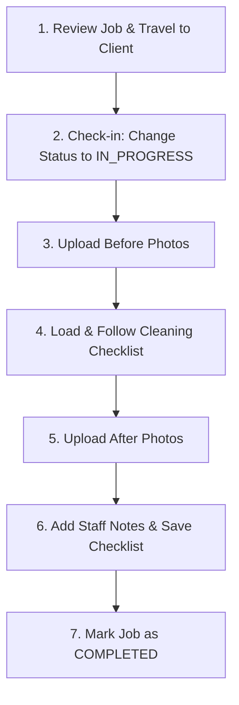

# La-Minks Cleaning Specialists: Operational & Dashboard Guide

Welcome to the **La-Minks Specialist Operations Manual**. This guide provides step-by-step instructions for navigating the **Staff Dashboard**, managing assigned cleaning jobs, tracking on-site checklists, uploading verification photos, and maintaining La-Minks luxury standards.

---

## 1. Accessing the Staff Dashboard

1. Navigate to [http://localhost:3000/login](http://localhost:3000/login) (or the production portal).
2. Enter your registered staff credentials:
   - **Email:** e.g., `staff@laminks.co.za`
   - **Password:** Your assigned password
3. Click **Sign In**. The system automatically redirects you to the Staff Dashboard at `/staff`.

---

## 2. Dashboard Overview (`/staff`)

The main dashboard is organized into three job sections:

### 2.1 Today's Jobs
- Displays all cleanings assigned to you for today.
- Shows the client's name, service type, scheduled time window, and address.
- Click the **Arrow Icon (&rarr;)** on any job card to open the **Job Execution Screen**.

### 2.2 Upcoming Jobs
- Displays future scheduled assignments so you can prepare equipment and plan your travel route.

### 2.3 Recently Completed
- Displays finished jobs for reference and record keeping.

---

## 3. Step-by-Step On-Site Job Workflow

---

### Step 1: Arrive on Site & Review Details
- Open the job at `/staff/bookings/[id]`.
- Verify the property address, access notes, client phone number, and selected extras (e.g., inside fridge, balcony cleaning).

---

### Step 2: Check In & Start the Job
1. In the **Job Status** box on the right, change the status from **CONFIRMED** to **IN PROGRESS**.
2. Click **Update Status**.
3. *Why this matters:* The customer's dashboard updates in real-time to show that the specialist has arrived and work has commenced.

---

### Step 3: Take & Upload "Before" Photos
1. Inspect the rooms/areas before starting work.
2. Under the **Job Verification Photos** section:
   - Click the **Before Photos** file selector.
   - Select or capture 2–4 photos showing initial condition and any pre-existing marks.
   - Click **Upload Before Photos**.
3. *Why this matters:* Protects both you and the company against claims of pre-existing damage and establishes the baseline for luxury transformation.

---

### Step 4: Follow & Complete the Cleaning Checklist
1. Under the **Cleaning Checklist** card:
   - If the checklist is empty, click **"+ Add Default Checklist"**. The system automatically loads tasks tailored to the booked service (e.g., Deep Clean, Move-Out, Carpet Extraction, Gardening).
2. As you clean each room or fixture:
   - Tap the checkbox next to each completed task.
   - If the client requests an additional task on-site, type it in the **"Add a custom task..."** input and tap **Add**.
3. Tap **"Save Checklist"** periodically to sync progress.
4. *Why this matters:* Customers can watch their live checklist being checked off in real time on their mobile dashboard.

---

### Step 5: Take & Upload "After" Photos
1. Once cleaning is finished, take 2–4 crisp photos of the transformed spaces (gleaming surfaces, made beds, spotless floors).
2. Select the files under **After Photos** and click **Upload After Photos**.
3. Verify the thumbnails appear in the photo gallery.

---

### Step 6: Add Staff Notes (Optional)
- In the **Staff Private Notes** box, record any notes relevant for future visits (e.g., *"Key left under flowerpot per client request"*, *"Hard water stains on master shower glass treated with descaler"*).
- Click **Save Notes**.

---

### Step 7: Mark Job as Completed
1. Verify all checklist items are checked off.
2. In the **Job Status** box, select **COMPLETED**.
3. Click **Update Status**.
4. Pack equipment, secure the property per client instructions, and proceed to your next assignment.

---

## 4. Cleaning Checklist Standards by Service

| Service Type | Key Focus Areas |
|:---|:---|
| **Standard / Home Cleaning** | High dusting, wipe appliances & counters, scrub bathroom fixtures, empty bins, vacuum carpets, mop hard floors, polish mirrors. |
| **Deep Cleaning** | Descaling tiles/grout, scrubbing inside/outside appliances, washing interior windows & sills, cleaning baseboards, door frames, and light switches. |
| **Move-In / Move-Out** | Cleaning inside all empty cupboards & wardrobes, deep appliance sanitization, spot-cleaning walls, removing ceiling cobwebs. |
| **Carpet & Upholstery** | Pre-treating heavy traffic stains, hot water extraction, deodorizing, fiber grooming, ensuring airflow for drying. |
| **Gardening** | Weeding, lawn mowing & edging, hedge trimming, sweeping walkways & patios, green waste disposal. |

---

## 5. Frequently Asked Questions for Cleaners

### Q: What if I arrive and the client is not home?
Call the client using the phone number provided on the job card. If there is no answer after 10 minutes, contact Admin immediately via the dispatch number.

### Q: What if a job requires more time than estimated?
If the property condition is significantly heavier than booked (e.g. extreme grease or post-renovation debris), take photos, update staff notes, and notify Admin so the quote can be adjusted if necessary.

### Q: What if I accidentally damage something?
1. Take clear photos of the item immediately.
2. Note the item in your **Staff Private Notes**.
3. Inform the client politely if they are on-site.
4. Notify Admin immediately so our insurance protocol can be initiated.

### Q: Can I edit the checklist?
Yes! You can check off items, delete tasks that are not applicable, or add custom tasks anytime before marking the job completed.
