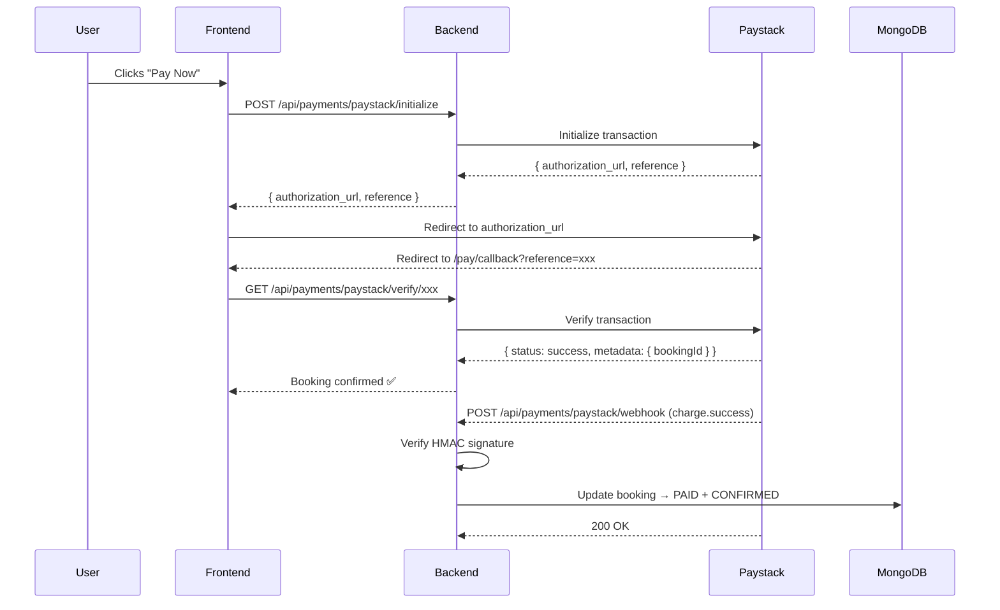

# Payment Webhook/Callback Handling — Walkthrough

## What Was Done

This session completed **Phase 5: Booking & Payments** by implementing the Paystack webhook endpoint and verifying the frontend callback page was already in place.

---

## Backend Changes

### 1. `paymentController.js`

Added a new `handlePaystackWebhook` function:

- **Signature Verification**: Uses `crypto.createHmac('sha512', secret)` to compute a hash of the raw request body and compares it against the `x-paystack-signature` header sent by Paystack. Requests with a mismatched signature are rejected with `400`.
- **Event Handling**: Listens for `charge.success` events. When received, it extracts `bookingId` from the transaction metadata.
- **ObjectId Validation**: Validates the `bookingId` format before calling MongoDB to prevent `CastError` crashes.
- **Booking Update**: Finds the matching booking and updates:
  - `payment.status` → `PAID`
  - `payment.paidAt` → timestamp from Paystack
  - `payment.channel` → e.g. `card`
  - `booking.status` → `CONFIRMED`
- **Always ACKs Paystack**: Returns `200 OK` regardless of internal processing—this is required so Paystack doesn't retry indefinitely.

```js
export const handlePaystackWebhook = async (req, res) => {
    const hash = crypto.createHmac('sha512', secret).update(JSON.stringify(req.body)).digest('hex');
    if (hash === req.headers['x-paystack-signature']) {
        // process charge.success → mark booking PAID + CONFIRMED
        res.sendStatus(200);
    } else {
        res.status(400).send('Invalid signature');
    }
};
```

---

### 2. `paymentRoutes.js`

Added the webhook route — **no auth middleware**, as the call comes from Paystack servers:

```js
router.post('/paystack/webhook', handlePaystackWebhook);
```

| Route | Method | Auth | Purpose |
|---|---|---|---|
| `/paystack/initialize` | POST | ✅ Protected | Start a payment |
| `/paystack/verify/:ref` | GET | ❌ Public | Frontend callback verification |
| `/paystack/webhook` | POST | ❌ Public | Paystack server event delivery |

---

## Frontend — Already Handled

The file `src/app/pay/callback/page.tsx` was already present and correctly:

- Reads the `?reference=` query param from the Paystack redirect URL
- Calls `GET /api/payments/paystack/verify/:reference`
- Shows a spinner → success (✅) or failure (❌) state

---

## How the Full Payment Flow Works



---

## Testing

Used `test-webhook.js` to simulate a `charge.success` event with a correctly computed HMAC signature against the running backend. The endpoint returned `200 OK`, confirming signature verification and routing work correctly.

---

## Deployment Note

Once deployed, register your webhook URL in the Paystack Dashboard under **Settings → API Keys & Webhooks**:

```
https://your-backend-domain.com/api/payments/paystack/webhook
```
